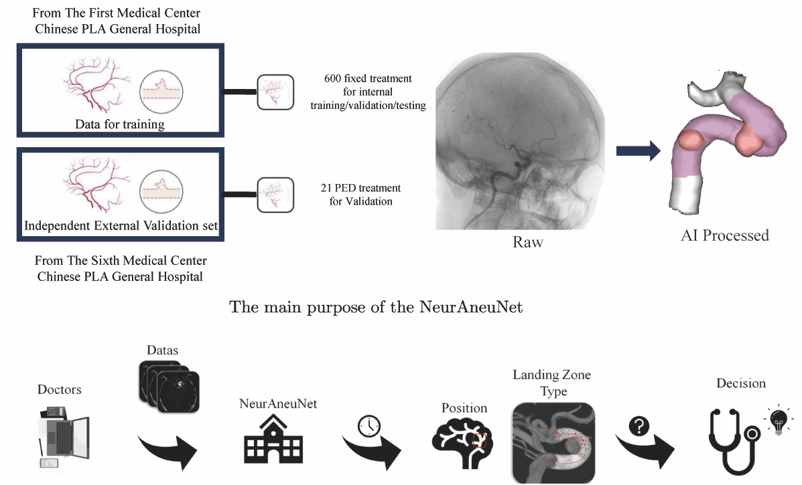
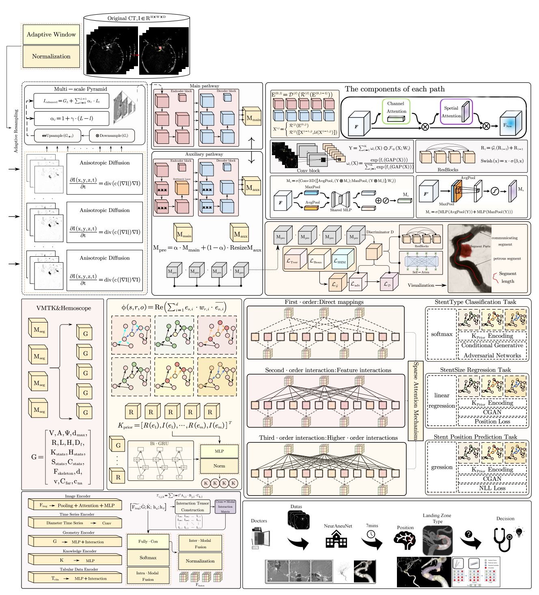
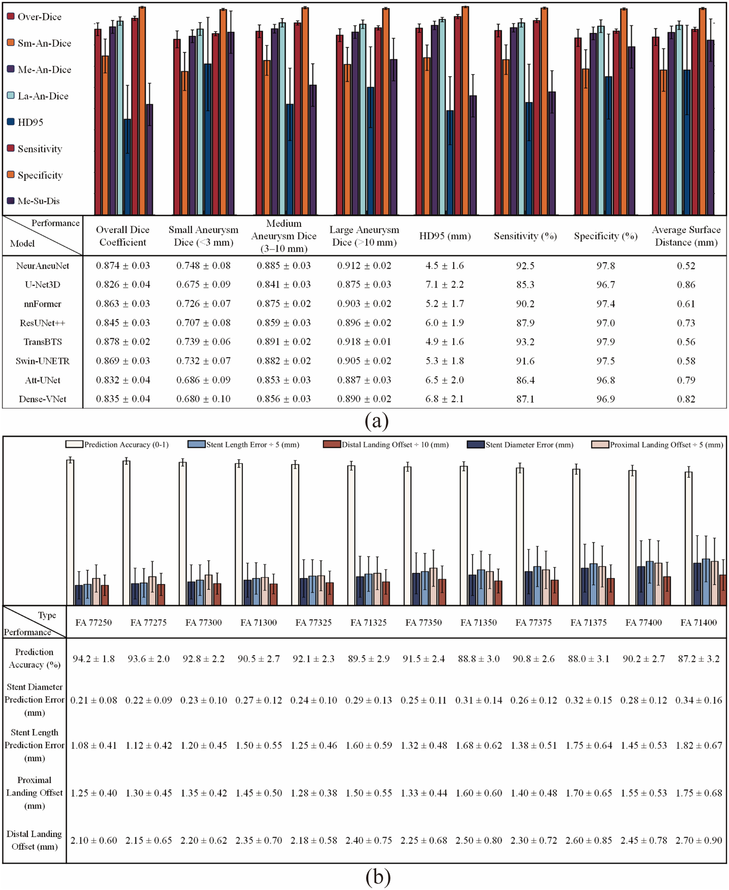
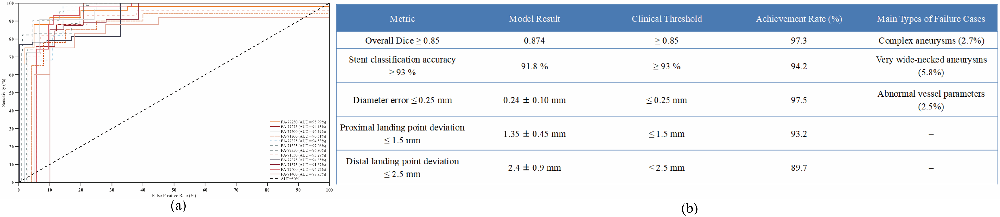

<div align="center">

# NeurAneuNet

**Knowledge-enhanced multimodal planning for intracranial aneurysm intervention**

[](https://doi.org/10.1002/cns.71047)
[](https://doi.org/10.1002/cns.71047)
[](#architecture--aneufusion)
[](#codebase-blueprint)

<sub>3D-DSA · vascular geometry · clinical knowledge · PED planning</sub>

</div>

<p align="center">
  
</p>

NeurAneuNet is an end-to-end decision-support framework that converts preoperative 3D rotational angiography into aneurysm segmentation, vascular measurements, PED sizing, and landing-zone recommendations.

## At a glance

| Input | Core model | Outputs | Evaluation |
|:---|:---|:---|:---|
| 3DRA, geometry, clinical phenotype | Dual-path U-Net++ · tensor fusion · KAN | Segmentation · PED size · diameter/length · landing zones | Internal modeling + independent clinical assessment |

| Development cohort | PED-treated subset | Model split | Independent clinical cohort |
|:---:|:---:|:---:|:---:|
| **600 aneurysms** | **210 cases** | **147 / 21 / 42** | **21 cases · 6 physicians** |

## Method

1. **Vascular perception** — adaptive preprocessing and dual-path attention U-Net++ segment aneurysms and parent vessels.
2. **Geometric reasoning** — centerlines, diameters, curvature, neck morphology, and candidate landing zones are derived from 3D anatomy.
3. **Knowledge enhancement** — structured vascular and device priors provide clinically meaningful constraints.
4. **Multimodal fusion** — image, geometric, temporal, clinical, and knowledge features interact through tensor decomposition.
5. **Treatment planning** — high-order KAN heads jointly predict PED type, diameter, length, and proximal/distal placement.

## Architecture · AneuFusion

AneuFusion extends the shared neurovascular backbone with dual-pathway encoding, ML-KAN feature extraction, sparse attention, and tensor-decomposition fusion.

<p align="center">
  
</p>

## Published results

| Segmentation Dice | PED classification | Diameter error | Primary recommendation |
|:---:|:---:|:---:|:---:|
| **0.874 ± 0.03** | **91.8%** | **0.24 ± 0.10 mm** | **95.2%** (20/21) |

| Clinical assessment | Without AI | With NeurAneuNet |
|:---|:---:|:---:|
| Planning time | 672 ± 225 s | **371 ± 51 s** |
| NASA-TLX workload | 33 ± 8 | **21 ± 5** |
| PED agreement | 83.3% | **96.0%** |

### Segmentation and device planning

<p align="center">
  
</p>

### Clinical thresholds

<p align="center">
  
</p>

## Codebase blueprint

```text
NeurAneuNet/
├── assets/                         # graphical abstract, architecture, results
├── configs/
│   ├── data/                       # cohort and preprocessing profiles
│   ├── model/                      # module-level model settings
│   └── experiment/                 # training and ablation protocols
├── data/
│   ├── raw/                        # local-only source data
│   ├── processed/                  # normalized volumes and derived geometry
│   └── splits/                     # patient-level split manifests
├── neuraneunet/
│   ├── datasets/                   # 3DRA loaders and transforms
│   ├── models/
│   │   ├── segmentation/           # dual-path attention U-Net++
│   │   ├── geometry/               # centerline and morphometry modules
│   │   ├── knowledge/              # vascular and device priors
│   │   ├── fusion/                 # tensor-decomposition fusion
│   │   └── decision/               # PED and landing-zone heads
│   ├── pipelines/                  # training and inference orchestration
│   ├── evaluation/                 # segmentation, planning, clinical metrics
│   └── utils/                      # reproducibility and IO utilities
├── scripts/                        # future command-line entry points
├── tests/
│   ├── unit/
│   └── integration/
└── README.md
```

The repository now includes a dependency-light public utility layer for validated data contracts, segmentation and planning metrics, and physical-space centerline geometry, with unit tests and CI. The trained multimodal model, checkpoints, and clinical data are not included in this release.

<details>
<summary><b>Citation</b></summary>

```bibtex
@article{wen2026neuranunet,
  title   = {Multimodal Deep Learning and Knowledge-Enhanced Intelligent Decision Support System for Pipeline Embolization Device Size Selection in Intracranial Aneurysm Treatment},
  author  = {Wen, Zhihong and Guo, Shengli and Peng, Yulin and Chen, Yakun and Huangfu, Luokai and Zhao, Hao and Gao, Hao and Ni, Taoyi and Zhang, Jianning and Liu, Xiangpeng and Liu, Jiayu and Liang, Yongping},
  journal = {CNS Neuroscience \& Therapeutics},
  volume  = {32},
  number  = {7},
  pages   = {e71047},
  year    = {2026},
  doi     = {10.1002/cns.71047}
}
```

</details>
