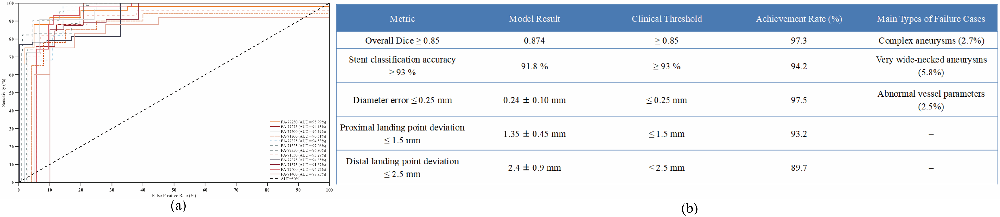
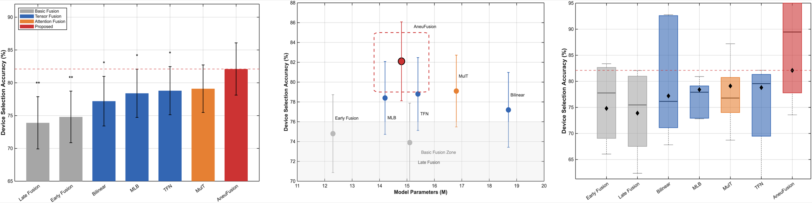

<div align="center">

# NeurAneuNet

**Knowledge-enhanced multimodal planning for intracranial aneurysm intervention**

[](https://doi.org/10.1002/cns.71047)
[](https://doi.org/10.1002/cns.71047)
[](#repository-layout)

</div>

NeurAneuNet unifies 3D vascular segmentation, geometric knowledge, multimodal fusion, and PED sizing within one decision-support pipeline.

## Architecture

<p align="center">
  
</p>

## Results

| PED recommendation | Planning time | Physician agreement |
|:---:|:---:|:---:|
| **95.2%** (20/21) | **672 → 371 s** | **83.3% → 96.0%** |

<p align="center">
  
</p>

## AneuFusion

**Research extension · manuscript in preparation**

AneuFusion shares the neurovascular backbone and extends the system with structured image–geometry–clinical fusion for PED selection.

| Selection accuracy | Diameter RMSE | Parameters |
|:---:|:---:|:---:|
| **82.1%** | **0.42 mm** | **14.8 M** |

<p align="center">
  
</p>

## Repository layout

```text
NeurAneuNet/
├── assets/                 # architecture and result figures
├── configs/                # experiment configurations
├── data/                   # dataset interfaces
├── models/
│   ├── segmentation/       # vascular segmentation backbone
│   ├── fusion/             # multimodal tensor fusion
│   └── decision/           # PED sizing and landing-zone heads
├── evaluation/             # clinical and model evaluation
└── README.md
```

> Model implementation is not included in this release.

<details>
<summary><b>Citation</b></summary>

```bibtex
@article{wen2026neuranunet,
  title   = {Multimodal Deep Learning and Knowledge-Enhanced Intelligent Decision Support System for Pipeline Embolization Device Size Selection in Intracranial Aneurysm Treatment},
  author  = {Wen, Zhihong and Guo, Shengli and Peng, Yulin and Chen, Yakun and Huangfu, Luokai and Zhao, Hao and Gao, Hao and Ni, Taoyi and Zhang, Jianning and Liu, Xiangpeng and Liu, Jiayu and Liang, Yongping},
  journal = {CNS Neuroscience \& Therapeutics},
  volume  = {32},
  number  = {7},
  pages   = {e71047},
  year    = {2026},
  doi     = {10.1002/cns.71047}
}
```

</details>
