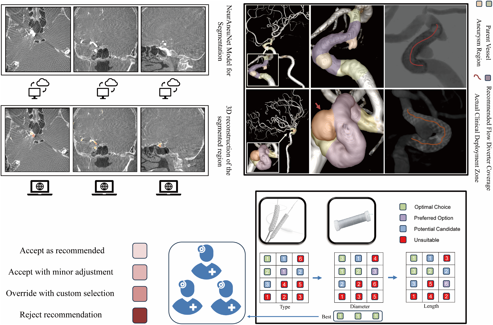
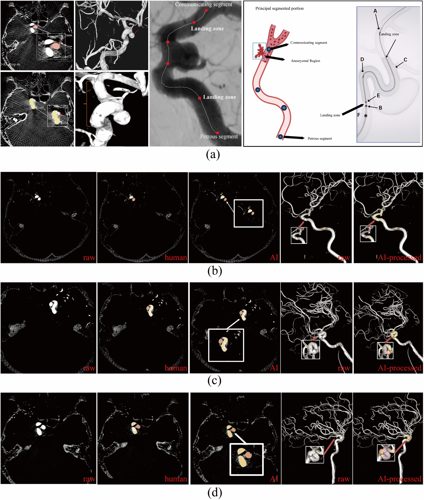

<div align="center">

# NeurAneuNet

**Knowledge-enhanced multimodal planning for intracranial aneurysm intervention**

[](https://doi.org/10.1002/cns.71047)
[](https://doi.org/10.1002/cns.71047)
[](#architecture--aneufusion)
[](#codebase-blueprint)

<sub>3D-DSA · vascular geometry · clinical knowledge · PED planning</sub>

</div>

<p align="center">
  
</p>

NeurAneuNet is an end-to-end decision-support framework that converts preoperative 3D rotational angiography into aneurysm segmentation, vascular measurements, PED sizing, and landing-zone recommendations.

## At a glance

<table align="center">
  <tr align="center">
    <th>Input</th><th>Core model</th><th>Outputs</th><th>Evaluation</th>
  </tr>
  <tr align="center">
    <td>3DRA, geometry,<br>clinical phenotype</td>
    <td>Dual-path U-Net++<br>tensor fusion · KAN</td>
    <td>Segmentation · PED size<br>diameter/length · landing zones</td>
    <td>Internal modeling<br>independent clinical assessment</td>
  </tr>
</table>

<table align="center">
  <tr align="center">
    <th>Development cohort</th><th>PED-treated subset</th><th>Model split</th><th>Independent clinical cohort</th>
  </tr>
  <tr align="center">
    <td><b>600 aneurysms</b></td><td><b>210 cases</b></td><td><b>147 / 21 / 42</b></td><td><b>21 cases · 6 physicians</b></td>
  </tr>
</table>

## Method

1. **Vascular perception** — adaptive preprocessing and dual-path attention U-Net++ segment aneurysms and parent vessels.
2. **Geometric reasoning** — centerlines, diameters, curvature, neck morphology, and candidate landing zones are derived from 3D anatomy.
3. **Knowledge enhancement** — structured vascular and device priors provide clinically meaningful constraints.
4. **Multimodal fusion** — image, geometric, temporal, clinical, and knowledge features interact through tensor decomposition.
5. **Treatment planning** — high-order KAN heads jointly predict PED type, diameter, length, and proximal/distal placement.

## Architecture · AneuFusion

AneuFusion extends the shared neurovascular backbone with dual-pathway encoding, ML-KAN feature extraction, sparse attention, and tensor-decomposition fusion.

<p align="center">
  
</p>

## Published results

<table align="center">
  <tr align="center">
    <th>Segmentation Dice</th><th>PED classification</th><th>Diameter error</th><th>Primary recommendation</th>
  </tr>
  <tr align="center">
    <td><b>0.874 ± 0.03</b></td><td><b>91.8%</b></td><td><b>0.24 ± 0.10 mm</b></td><td><b>95.2%</b> (20/21)</td>
  </tr>
</table>

<table align="center">
  <tr align="center">
    <th>Clinical assessment</th><th>Without AI</th><th>With NeurAneuNet</th>
  </tr>
  <tr align="center"><td>Planning time</td><td>672 ± 225 s</td><td><b>371 ± 51 s</b></td></tr>
  <tr align="center"><td>NASA-TLX workload</td><td>33 ± 8</td><td><b>21 ± 5</b></td></tr>
  <tr align="center"><td>PED agreement</td><td>83.3%</td><td><b>96.0%</b></td></tr>
</table>

### Clinical workflow

The system follows a single clinical chain from 3DRA reconstruction and aneurysm delineation to vascular measurement, PED sizing, and physician assessment. This design keeps anatomical perception and treatment planning within the same auditable workflow.

<p align="center">
  <br>
  <sub>Figure 1. Clinical workflow and PED recommendation study design.</sub>
</p>

### Representative segmentations

Representative cases compare raw angiography, expert annotations, and model predictions in both 2D slices and 3D reconstructions. The examples illustrate preservation of the aneurysm boundary and its relationship to the parent vessel across different morphologies.

<p align="center">
  <br>
  <sub>Figure 2. Qualitative aneurysm segmentation in representative clinical cases.</sub>
</p>

### Segmentation and device planning

Quantitative evaluation connects segmentation quality with downstream PED selection and positioning. Performance is reported across device sizes and landing-zone targets rather than treating segmentation as an isolated endpoint.

<p align="center">
  <br>
  <sub>Figure 3. Segmentation and device-planning performance.</sub>
</p>

### Clinical thresholds

ROC analysis evaluates PED model discrimination, while the threshold panel summarizes whether each output meets its predefined clinical target. The combined view makes both predictive accuracy and operational acceptability visible.

<p align="center">
  <br>
  <sub>Figure 4. PED classification and clinical-threshold analysis.</sub>
</p>

Published tables: [clinical assistance](results/clinical_assistance.csv) · [morphometric agreement](results/morphometric_agreement.csv) · [single vs. multiple aneurysms](results/single_vs_multiple_aneurysms.csv)

## Codebase blueprint

```text
NeurAneuNet/
├── assets/                         # graphical abstract, architecture, result figures
├── results/                        # machine-readable published tables
├── configs/
│   ├── data/                       # cohort and preprocessing profiles
│   ├── model/                      # module-level model settings
│   └── experiment/                 # training and ablation protocols
├── data/
│   ├── raw/                        # local-only source data
│   ├── processed/                  # normalized volumes and derived geometry
│   └── splits/                     # patient-level split manifests
├── neuraneunet/
│   ├── datasets/                   # 3DRA loaders and transforms
│   ├── models/
│   │   ├── segmentation/           # dual-path attention U-Net++
│   │   ├── geometry/               # centerline and morphometry modules
│   │   ├── knowledge/              # vascular and device priors
│   │   ├── fusion/                 # tensor-decomposition fusion
│   │   └── decision/               # PED and landing-zone heads
│   ├── pipelines/                  # training and inference orchestration
│   ├── evaluation/                 # segmentation, planning, clinical metrics
│   └── utils/                      # reproducibility and IO utilities
├── scripts/                        # future command-line entry points
├── tests/
│   ├── unit/
│   └── integration/
└── README.md
```

The repository now includes a dependency-light public utility layer for validated data contracts, segmentation and planning metrics, and physical-space centerline geometry, with unit tests and CI. The trained multimodal model, checkpoints, and clinical data are not included in this release.

<details>
<summary><b>Citation</b></summary>

```bibtex
@article{wen2026neuranunet,
  title   = {Multimodal Deep Learning and Knowledge-Enhanced Intelligent Decision Support System for Pipeline Embolization Device Size Selection in Intracranial Aneurysm Treatment},
  author  = {Wen, Zhihong and Guo, Shengli and Peng, Yulin and Chen, Yakun and Huangfu, Luokai and Zhao, Hao and Gao, Hao and Ni, Taoyi and Zhang, Jianning and Liu, Xiangpeng and Liu, Jiayu and Liang, Yongping},
  journal = {CNS Neuroscience \& Therapeutics},
  volume  = {32},
  number  = {7},
  pages   = {e71047},
  year    = {2026},
  doi     = {10.1002/cns.71047}
}
```

</details>
